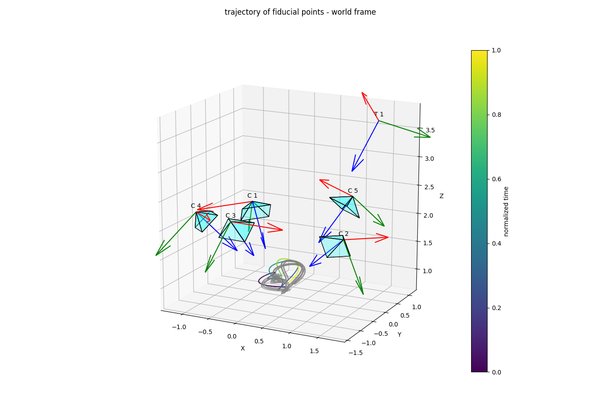

# SyntheticTrajectoryGeneration
Python package for generating synthetic checkerboard trajectories and multi view camera projections of them.


## Installation
Create a python environment and install this package by

```bash
git clone git@github.com:robinjacobs/SyntheticCheckerboardTrajectories.git
cd SyntheticCheckerboardTrajectories
pip install -e . 
```

## Generate Trajectories
To run the trajectory generation and save it, run the following:
```bash
python -m scripts.run
```
The trajectories will be stored in the `output` folder. This output can then e.g., be used in a multi camera calibration algorithm for testing the calibration and time synchronization.
### Plots
For debugging purposes, it is also possible to launch some figures, e.g., for plotting the scenes with regards to all the cameras and trajectories as well as camera projections. For this one can specify the arguments:
```bash
python -m scripts.run -p
```

**Note**: Depending on the trajectory length this might take some time.

### Use in blender rendering pipeline

```bash
python -m scripts.run_for_blender -c PATH_TO_CAMERA_CSV -p PATH_TO_CHECKERBOARD_JSON
```
An example on how the checkerboard.json looks like can be found in `data/example_checkerboard.json`. 

### Debug and Testing
A small selection of tests and plots for the generated data can be started by
```bash
python -m scripts.test -r PATH_TO_GEN_FOLDER
```

To test the camera calibration results (coming from an external method) one can also launch

```bash
python -m scripts.check_calibration_results -r GEN_FOLDER_BEFORE_CALIBRATION -a GEN_FOLDER_AFTER_CALIBRATION
```
**Note** This method only works if the multi camera calibration method has overwritten the orignal, generated camera calibration files if the overwrite flag -o was set)




For testing the blender renders against the synthetic projection use
```bash
python -m scripts.overlay_with_render -f OUTPUT_PATH -i RENDER_IMAGE_PATH
```

## Configuration
The `generate` method in `generator.py` takes as an argument an instance of `GeneratorConfig` which specifies the scene and the checkerboard trajectories to be created. The default configuration is defined in `scripts/run.py`.

```Python
@dataclass
class GeneratorConfig(PrintableConfig):
    """Configuration defining the scene and the simulation parameters"""

    checkerboard: CheckerboardConfig
    cameras: CamerasConfig
    tracker: Optional[TrackerConfig]
    working_volume_center_pos: np.array
    time_start_s: float
    time_end_s: float
    sample_freq_tracker_hz: int  # needs to be an integer
    sample_freq_cameras_hz: int  # needs to be an integer
    cameras_t_offset_s: List[float]  # This is the offset we want to estimate
    tracker_t_offset_s: float
    master_idx: int  # Camera idx which is set to be the master clock
```
When specifying the sampling frequency of the cameras and tracker, note that the internal "simulation" frequency is set to the least common multiple of both.

## Output Structure
The created output folders follow the following structure: 
```
output /
    recordings /
        atracsys_33***84_2022-06-10_11-39.csv              
        atracsys_33***84_2022-06-10_11-39_calibration.json  
        atracsys_33***84_2022-06-10_11-39_original.csv      
        ...
        hololens2_00***01_2022-06-09_21-39 /                 
        hololens2_00***01_calibration.json                  
        kinect_00***12_2022-06-10_11-34 /                   
            rgb_undist /
                268377.png
                ...
            factory_calibration.json                        
            markers_rgb.csv                                 
            ...
        kinect_00***12_2022-06-10_11-34.mkv                  
        kinect_00***12_2022-06-11_15-20.log                  
        kinect_00***12_calibration.json        
    recordings.json
    generation_config.json   # Contains all thedata and parameters used in the trajectory generation
    

```

# Documentation
For further documentation about the code and the theory behind see `media/SyntheticTrajectoryGeneration_Documentation.pdf`

# Acknowledgments
This work was done during a stay at the Research in Orthopedic Computer Science Group ([ROCS](https://rocs.balgrist.ch)) at Balgrist Hospital Zurich.
